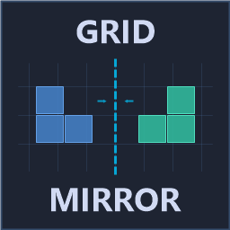

  

# GridMirror

A Space Engineers plugin that mirrors grids along an axis and copies the result to your clipboard for pasting.

## Requirements

- Creative mode or creative tools enabled

## Usage

1. Look at the grid you want to mirror
2. Type `/mirror [axis]` in chat

| Command | Description |
|---|---|
| `/mirror` | Mirror along X axis (default) |
| `/mirror X` | Mirror left/right |
| `/mirror Y` | Mirror up/down |
| `/mirror Z` | Mirror forward/back |
| `/mirror help` | Show help |

3. The mirrored grid is placed on your clipboard — paste it with **Ctrl+V**
